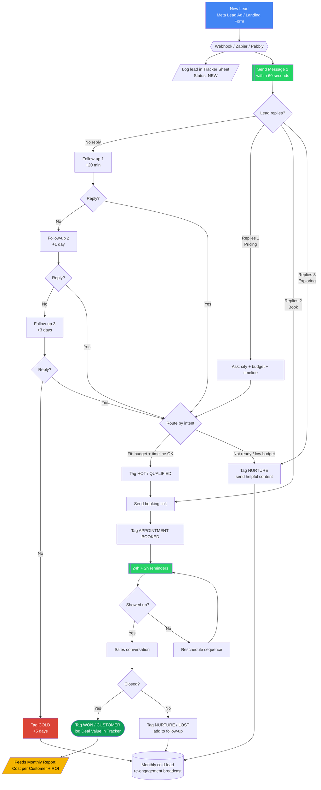

# Deliverable 4 — WhatsApp Flow Diagram (Visual)

Hand this to whoever sets up your automation tool. It maps the entire lead journey from ad click to customer.

### How to read it
- **Blue** = entry point (the ad/form).
- **Green** = automated WhatsApp actions (the part that runs without you).
- **Red** = cold lead (recycled monthly, never thrown away).
- **Green oval (WON)** = a paying customer — this is what feeds your ROI report.
- **Yellow** = the closed-loop reporting that justifies your premium pricing.

> If your tool doesn't render Mermaid, paste this into the live editor at https://mermaid.live to view/export it as an image.
